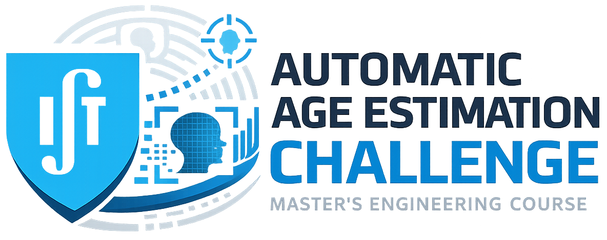

# Spoken Language Processing 2025/2026 - Instituto Superior Técnico
### Laboratory Assignment 2 - Automatic Age Estimation Challenge
<!--[image](imgs/lab2_slp_banner.png)-->

This repository contains the Jupyter Notebooks and utility modules needed to complete the second laboratory assignment of the Spoken Language Processing course:

- lab2_intro.ipynb: This introduction notebook presents the target tasks, the two main parts of this assignment, the data used and the Kaggle competition and final mandatory deliverables. It also demonstrates the data class used to download data and do (fake) feature extraction.

- lab2_classical.ipynb: This notebook contains the code that permits training and evaluating two classical systems based on conventional hand-crafted features.

- lab2_xvec.ipynb: This notebook contains the code that permits training and evaluating a modern system based on neural speaker embedding features.

- lab2_ssl.ipynb: This notebook contains the code that permits training and evaluating a modern system based on self-supervised learning (SSL) models.

- pf_tools.py: This Python script defines entities and functions that are necessary for setting up the task, downloading data and training and evaluating some of the baseline systems. 

- requirements.txt: This file lists the module dependencies that need to be installed.

## Contacts

Alberto Abad - alberto.abad@tecnico.ulisboa.pt
